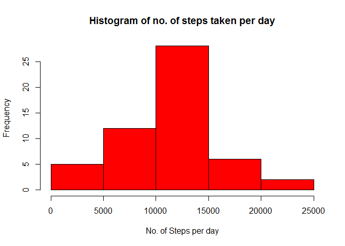
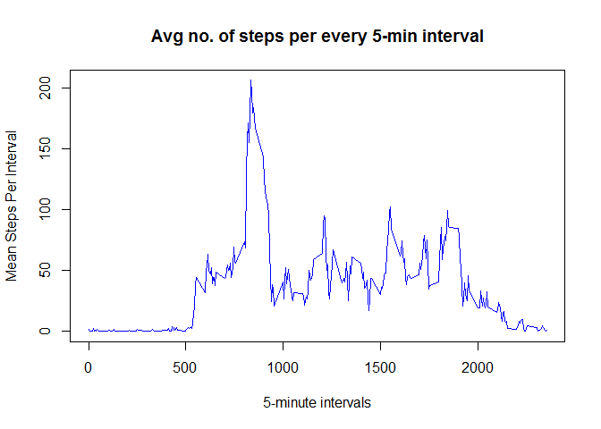
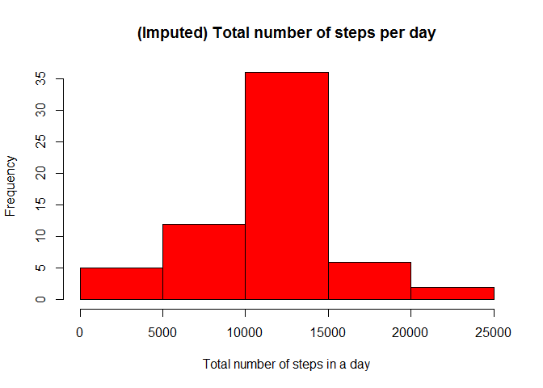
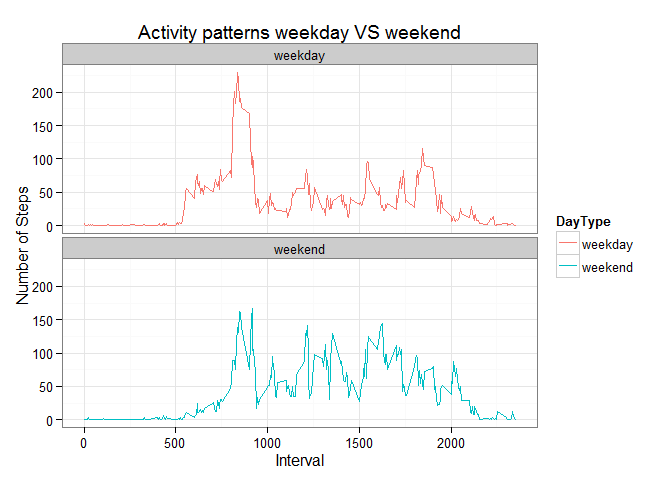

COURSERA-REPRODUCIBLE RESEARCH PA-1
====================================
author: "Vaddi"
date: "October 10, 2015"
output: html_document

## Loading and preprocessing the data
###1.loading data
The file containing the activity monitoring data is downloaded and stored in current working directory. It is read in R using read.csv function.


```r
activity_data<-read.csv("activity.CSV",header=TRUE,sep=",")
```

###2.Pre-procesing the data


```r
str(activity_data)
```

```
## 'data.frame':	17568 obs. of  3 variables:
##  $ steps   : int  NA NA NA NA NA NA NA NA NA NA ...
##  $ date    : Factor w/ 61 levels "2012-10-01","2012-10-02",..: 1 1 1 1 1 1 1 1 1 1 ...
##  $ interval: int  0 5 10 15 20 25 30 35 40 45 ...
```
class of date is factor is now to be changed to "Date" class using as.Date


```r
activity_data$date<-as.Date(activity_data$date)
```
##What is mean total number of steps taken per day?
###1.total number of steps taken per day

```r
suppressMessages(library(dplyr))
library(knitr)
StepsPerDay<-summarise(group_by(activity_data,date),steps=sum(steps))
head(StepsPerDay)
```

```
## Source: local data frame [6 x 2]
## 
##         date steps
## 1 2012-10-01    NA
## 2 2012-10-02   126
## 3 2012-10-03 11352
## 4 2012-10-04 12116
## 5 2012-10-05 13294
## 6 2012-10-06 15420
```
###2.Histogram of the total number of steps taken each day

The histogram of total number of steps taken per day is drawn using plot function.


```r
hist(StepsPerDay$steps,xlab="No. of Steps per day",main="Histogram of no. of steps taken per day",col="red")
```

 

### 3.Calculate and report the mean and median total number of steps taken per day. Store mean and median in variables for future data transformation.


```r
meanStepsPerDay<-mean(StepsPerDay$steps,na.rm=TRUE)
meanStepsPerDay
```

```
## [1] 10766.19
```

```r
medianStepsPerDay<-median(StepsPerDay$steps,na.rm=TRUE)
medianStepsPerDay
```

```
## [1] 10765
```

###What is the average daily activity pattern?
 1.Make a time series plot (i.e. type = "l") of the 5-minute interval (x-axis) and the average number of steps taken, averaged across all days (y-axis)

```r
steps_per_interval<-summarise(group_by(activity_data,interval),steps=mean(steps,na.rm=TRUE))
plot(steps_per_interval$interval,steps_per_interval$steps,xlab="5-minute intervals",ylab="Mean Steps Per Interval",type="l",col="blue",main="Avg no. of steps per every 5-min interval")
```

 


2.Which 5-minute interval, on average across all the days in the dataset, contains the maximum number of steps?

```r
MaxRowId<-which.max(steps_per_interval$steps)
MaxRowId
```

```
## [1] 104
```

```r
steps_per_interval[MaxRowId,]
```

```
## Source: local data frame [1 x 2]
## 
##   interval    steps
## 1      835 206.1698
```
###Imputing missing values
1.Calculate and report the total number of missing values in the dataset (i.e. the total number of rows with NAs)

```r
TotalMissingValues<-sum(is.na(activity_data))
TotalMissingValues
```

```
## [1] 2304
```
2.Devise a strategy for filling in all of the missing values in the dataset
  
 Create a new dataset that is equal to the original dataset but with the missing data filled in.
 NA values are replaced with the mean values of the corresponding intervals(mean step  values rounded off to nearest integer) and new data set is  generated
 

```r
steps_per_interval$steps<-round(steps_per_interval$steps)
Steps_NA<-activity_data[is.na(activity_data$steps),3]
Intervals_matched<-match(Steps_NA,steps_per_interval$interval)
replacing_StepAvg<-steps_per_interval[Intervals_matched,2]
new_activity_data<-activity_data
new_activity_data[is.na(new_activity_data$steps),1]<-replacing_StepAvg
head(new_activity_data,10)
```

```
##    steps       date interval
## 1      2 2012-10-01        0
## 2      0 2012-10-01        5
## 3      0 2012-10-01       10
## 4      0 2012-10-01       15
## 5      0 2012-10-01       20
## 6      2 2012-10-01       25
## 7      1 2012-10-01       30
## 8      1 2012-10-01       35
## 9      0 2012-10-01       40
## 10     1 2012-10-01       45
```
4.Make a histogram of the total number of steps taken each day  


```r
StepsPerDayNew<-summarise(group_by(new_activity_data,date),steps=sum(steps))
hist(StepsPerDayNew$steps,main="(Imputed) Total number of steps per day", xlab="Total number of steps in a day",col="red")
```

 


Calculate and report the mean and median total number of steps taken per day. Do these values differ from the estimates from the first part of the assignment? What is the impact of imputing missing data on the estimates of the total daily number of steps?

```r
meanStepsPerDayNew<-mean(StepsPerDayNew$steps,na.rm=TRUE)
meanStepsPerDayNew
```

```
## [1] 10765.64
```

```r
medianStepsPerDayNew<-median(StepsPerDayNew$steps,na.rm=TRUE)
medianStepsPerDayNew
```

```
## [1] 10762
```
It is observed that there is no significant change in the mean and median of total number of steps taken after replacing the NA values.


### Differences in activity patterns between weekdays and weekends?
1.Creating a new factor variable in the dataset with two levels - "weekday" and "weekend" indicating whether a given date is a weekday or weekend day.
Using weekdays() function,day of the week can be found from the date.A new column containing day of the week is added to original dataframe

```r
new_activity_data$date<-as.Date(new_activity_data$date)
new_activity_data$DayType<-weekdays(new_activity_data$date)
head(new_activity_data)
```

```
##   steps       date interval DayType
## 1     2 2012-10-01        0  Monday
## 2     0 2012-10-01        5  Monday
## 3     0 2012-10-01       10  Monday
## 4     0 2012-10-01       15  Monday
## 5     0 2012-10-01       20  Monday
## 6     2 2012-10-01       25  Monday
```

Make a panel plot containing a time series plot (i.e. type = "l") of the 5-minute interval (x-axis) and the average number of steps taken, averaged across all weekday days or weekend days (y-axis)


```r
weekend<-filter(new_activity_data,grepl('Saturday|Sunday',DayType))
weekday<-filter(new_activity_data,!grepl('Saturday|Sunday',DayType))
weekday$DayType<-c("weekday")
weekend$DayType<-c("weekend")
weekday_weekend<-rbind(weekday,weekend)

weekday_weekendAvg<-summarise(group_by(weekday_weekend,interval,DayType),steps=mean(steps))
```

Panel plot using ggplot2


```r
library(ggplot2)
g<-ggplot(weekday_weekendAvg,aes(interval,steps,color=DayType))

    g+geom_line(type="l")+
        facet_wrap(~DayType,ncol=1,nrow=2)+
        theme_bw(base_size = 12)+
        labs(x="Interval")+
        labs(y ="Number of Steps")+
        labs(title="Activity patterns weekday VS weekend" )
```

 


             ==END==


